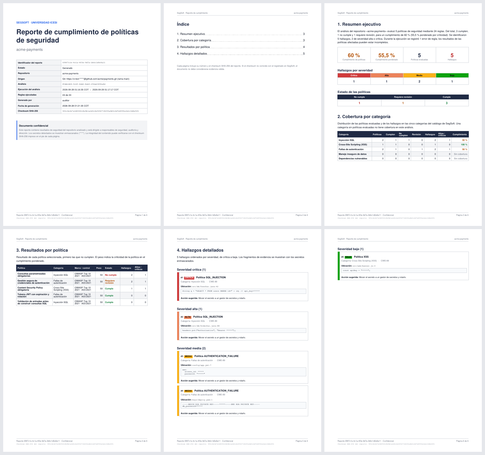

# Plantilla del reporte de cumplimiento en PDF

Especificación visual y estructural del PDF que genera
`GET /api/v1/reports/{id}/export?format=pdf`. La implementación está en
`segsoft-backend`:

- `export/pdf/PdfReportTheme.java`: tipografía, colores y etiquetas.
- `export/pdf/PdfReportExporter.java`: estructura y secciones.
- `export/pdf/PdfPageDecorator.java`: encabezado y pie de página.

**Ejemplo generado:** [ejemplos/reporte-cumplimiento-ejemplo.pdf](ejemplos/reporte-cumplimiento-ejemplo.pdf)



> **Pendiente:** aprobación del equipo sobre este PDF de ejemplo (criterio de
> terminado de la subtarea "Diseñar plantilla PDF").

---

## Estructura

| # | Sección | Contenido | Página |
|---|---|---|---|
| — | **Portada** | Título, nombre del repositorio y tabla de metadatos: id del reporte, estado, repositorio, origen (ZIP o Git + rama), SHA-256 del archivo, id del análisis, inicio y fin del análisis, reglas ejecutadas, generado por, fecha de generación y checksum SHA-256. Cierra con un aviso de confidencialidad. | 1 |
| — | **Índice** | Las 4 secciones con número de página y enlace interno. | 2 |
| 1 | **Resumen ejecutivo** | Párrafo narrativo, 4 KPI (cumplimiento, cumplimiento ponderado, políticas evaluadas, hallazgos), hallazgos por severidad y estado de las políticas. | 3 |
| 2 | **Cobertura por categoría** | Tabla con las **5 categorías del catálogo** siempre presentes (una categoría sin políticas muestra "Sin cobertura"). | a continuación |
| 3 | **Resultados por política** | Tabla ordenada por estado (primero *No cumple*, luego *Requiere revisión*, luego *Cumple*) y después por nombre. | página nueva |
| 4 | **Hallazgos detallados** | Agrupados y **ordenados por severidad** (crítica → alta → media → baja) y, dentro de cada grupo, por política, archivo y línea. | página nueva |

**En todas las páginas:**

- **Pie:** `Reporte <id> · Confidencial`, `Página X de Y` y `Checksum SHA-256 del reporte: <checksum>`.
- **Encabezado** (desde la página 2): `SegSoft · Reporte de cumplimiento` y el nombre del repositorio.

El índice y el "de Y" se calculan con un render en dos pasadas. El índice
ocupa siempre una página, así que el layout es idéntico en ambas.

### Bloque de hallazgo

```
▌ #3  [MEDIA]  Nombre de la política
▌ Categoría: Fallas de autenticación · CWE-798
▌ Ubicación: config/app.yml:7
▌ ┌──────────────────────────────────────────┐
▌ │ password: "*****"          (Courier)      │
▌ └──────────────────────────────────────────┘
▌ Acción sugerida: …
```

La franja izquierda (▌) usa el color de la severidad. Cada bloque no se parte
entre páginas, y el título de un grupo de severidad nunca queda huérfano al pie
de una página.

## Página y tipografía

- **Tamaño:** A4 vertical. Márgenes de 50 pt a los lados, 62 pt arriba y 64 pt abajo.
- **Fuentes:** base-14, sin embeber (ver [ADR 0001](adr/0001-libreria-pdf-openpdf.md)).

| Uso | Fuente | Tamaño |
|---|---|---|
| Título de portada | Helvetica Bold | 26 pt |
| Título de sección (H1) | Helvetica Bold | 16 pt |
| Subtítulo (H2) | Helvetica Bold | 11,5 pt |
| Cuerpo | Helvetica | 9,5 pt |
| Celdas de tabla | Helvetica | 8,5 pt |
| Encabezado de tabla | Helvetica Bold, blanco | 8 pt |
| Evidencia, rutas, ids, checksum | Courier | 7,5 pt (6,5 pt en el pie) |
| Encabezado y pie de página | Helvetica, gris | 7,5 pt |

## Colores

Los colores de severidad son los mismos del frontend (`SEVERITY_HEX` en
`segsoft-frontend/src/utils/severityColors.ts`), para que un hallazgo se lea
igual en la app y en papel.

| Severidad | Relleno | Texto sobre el relleno |
|---|---|---|
| Crítica | `#D03B3B` | blanco |
| Alta | `#EC835A` | `#0B0B0B` |
| Media | `#FAB219` | `#0B0B0B` |
| Baja | `#0CA30C` | `#0B0B0B` |

| Estado de política / cumplimiento | Color |
|---|---|
| Cumple / ≥ 80 % | `#15803D` |
| Requiere revisión / 50–79 % | `#B45309` |
| No cumple / < 50 % | `#B91C1C` |

| Elemento | Color |
|---|---|
| Primario (títulos, encabezados de tabla) | `#1F2A44` |
| Acento (antetítulo, borde del aviso) | `#2563EB` |
| Texto | `#111827` |
| Texto secundario | `#6B7280` |
| Bordes de tabla | `#D1D5DB` |
| Filas alternas (cebra) y etiquetas | `#F3F4F6` |
| Fondo de evidencia | `#F8FAFC` |

## Tablas

- El encabezado usa fondo primario y texto blanco en negrita, y **se repite en
  cada página** cuando la tabla se parte.
- Filas en cebra (blanco / `#F3F4F6`), bordes de 0,5 pt en `#D1D5DB` y padding
  de 4,5 pt.
- Los números van alineados a la derecha. El estado de cada política va en
  negrita con su color.

## Confidencialidad y saneamiento

Todo texto que proviene del repositorio o de los usuarios (nombres, rutas,
URLs, snippets, acciones sugeridas) pasa por `ReportTextSanitizer` antes de
embeberse. En este orden:

1. Normalización NFC, eliminación de caracteres de control, *bidi overrides*
   (ataque "Trojan Source"), caracteres de ancho cero y BOM.
2. **Enmascarado de secretos** con `SecretMaskingService`, aunque el motor ya
   los haya enmascarado. Cubre asignaciones `clave=valor` (`api_key`,
   `password`, `token`, `secret`…), claves AWS, tokens de GitHub, Slack y
   Stripe, API keys de Google, JWT, `Bearer`, credenciales en URLs y bloques
   `PRIVATE KEY`. Se hace después del paso 1, para que un carácter invisible
   no pueda romper el patrón.
3. Truncado: 400 caracteres por campo y 600 por snippet.

El contenido del reporte se guarda ya enmascarado en `reports.content_json`, y
el exportador lo enmascara de nuevo como defensa en profundidad.
